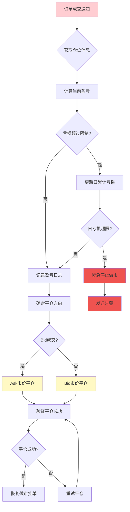
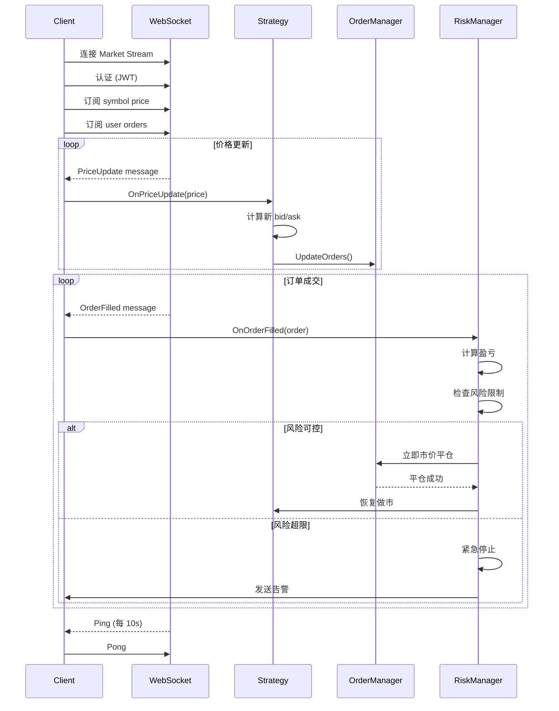

# StandX 做市机器人架构设计

## 项目概述

自动挂单机器人，用于参与 StandX Market Maker Uptime Program，通过持续提供流动性获取积分奖励。

### 目标

- 自动维持双边挂单（bid + ask）
- 订单价格保持在中间价 10 bps 以内
- 每小时保持 70%+ 在线时间
- 订单规模接近 2 BTC 上限
- **风险控制**: 吃单后立即平仓，不累积仓位

## 技术选型

| 技术栈 | 选择 | 理由 |
|--------|------|------|
| 语言 | Go 1.21+ | 高并发、高性能、部署简单 |
| 加密 | crypto/ed25519 | 标准库，无需外部依赖 |
| Base58 | github.com/mr-tron/base58 | requestId 编码 |
| 以太坊 | github.com/ethereum/go-ethereum | 钱包签名 |
| HTTP | net/http | 标准库 |
| WebSocket | gorilla/websocket | 成熟的 WebSocket 库 |
| 配置 | github.com/spf13/viper | 灵活配置管理 |
| 日志 | slog (Go 1.21+) | 结构化日志 |

## 模块设计

### 1. 认证模块 (pkg/auth)

**职责**: 处理 StandX API 认证

**核心流程**:
```
1. 生成 ed25519 密钥对
2. requestId = base58(publicKey)
3. prepare-signin 获取 signedData
4. 钱包签名 message
5. login 获取 access token
```

**接口定义**:
```go
type Auth struct {
    ed25519PrivateKey ed25519.PrivateKey
    ed25519PublicKey  ed25519.PublicKey
    requestId         string
    baseURL           string
}

func (a *Auth) Authenticate(chain, address string, signFn SignFunc) (*LoginResponse, error)
func (a *Auth) SignRequest(payload []byte, reqID string, timestamp int64) (*RequestSignature, error)
```

**关键类型**:
```go
type Chain string // "bsc" | "solana"

type SignedData struct {
    Domain    string
    URI       string
    Statement string
    Version   string
    ChainID   int
    Nonce     string
    Address   string
    RequestID string
    Message   string
    Exp       int
    Iat       int
}

type LoginResponse struct {
    Token      string
    Address    string
    Alias      string
    Chain      string
    PerpsAlpha bool
}
```

### 2. API 客户端 (pkg/client)

**职责**: 封装 StandX API 调用，自动处理请求签名

**核心功能**:
- 自动添加认证头
- 请求签名 (Body Signature Flow)
- 错误处理和重试
- Token 刷新

### 2.5 WebSocket 客户端 (pkg/ws)

**职责**: 实时接收市场数据和订单状态更新

**核心功能**:
- 订阅价格推送
- 订阅订单状态更新
- Ping/Pong 心跳维持
- 自动重连

**接口定义**:
```go
type WSClient struct {
    conn        *websocket.Conn
    url         string
    token       string
    msgHandler  MessageHandler
    reconnectCh chan struct{}
}

type MessageHandler interface {
    OnPriceUpdate(PriceMessage)
    OnOrderUpdate(OrderUpdateMessage)
    OnPositionUpdate(PositionMessage)
}

func (ws *WSClient) Connect(token string) error
func (ws *WSClient) SubscribePrice(symbol string) error
func (ws *WSClient) SubscribeUserOrders() error
func (ws *WSClient) Close() error
```

**WebSocket 流**:
| 流类型 | 端点 | 用途 |
|--------|------|------|
| Market Stream | wss://perps.standx.com/ws/market | 价格、深度、用户数据 |
| Order Response | wss://perps.standx.com/ws/order_response | 订单创建响应 |

### 3. 订单管理器 (pkg/order)

**职责**: 管理订单生命周期

**核心功能**:
- 创建双边挂单
- 追踪订单状态
- 自动刷新订单
- 取消过期订单

**接口定义**:
```go
type Manager struct {
    client    *client.Client
    bidOrder  *Order
    askOrder  *Order
    mutex     sync.RWMutex
}

func (m *Manager) PlaceBidAsk(bidPrice, askPrice, size float64) error
func (m *Manager) UpdateOrders(newBidPrice, newAskPrice float64) error
func (m *Manager) CancelAll() error
func (m *Manager) GetActiveOrders() (*OrderPair, error)
```

### 4. 做市策略 (pkg/strategy)

**职责**: 实现做市逻辑，决定挂单价格和规模

**核心算法**:
```
1. WebSocket 接收价格更新
2. 计算挂单价格:
   - bid = markPrice × (1 - spread/2)
   - ask = markPrice × (1 + spread/2)
3. 确保在 10 bps 以内
4. 订单规模 = 2 BTC (可配置)
```

**接口定义**:
```go
type MarketMaker struct {
    orderMgr  *order.Manager
    pricer    *Pricer
    config    *Config
}

func (mm *MarketMaker) Run(ctx context.Context) error
func (mm *MarketMaker) calculatePrices() (bid, ask float64, err error)
```

### 5. 风险管理 (pkg/risk)

**职责**: 处理吃单风险，控制仓位暴露

**风险场景分析**:
```
价格快速上涨: ask 单被成交 → 卖出 BTC → 空头仓位
价格快速下跌: bid 单被成交 → 买入 BTC → 多头仓位
```

**采用策略: 立即平仓（保守策略）**

核心原则：
- 吃单后立即以市价平仓
- 不累积任何仓位
- 接受小幅价差损失，保证持续做市

**接口定义**:
```go
type RiskManager struct {
    client           *client.Client
    maxLossPercent   float64  // 单笔最大亏损百分比
    enableAutoClose  bool     // 是否自动平仓
    positionTracker  *PositionTracker
}

type PositionTracker struct {
    netPosition float64  // 净仓位 (BTC)
    avgPrice    float64  // 平均成交价
    mutex       sync.RWMutex
}

// 检查订单是否被成交
func (rm *RiskManager) CheckOrderFilled(orderID string) (*Order, error)

// 处理吃单事件
func (rm *RiskManager) OnOrderFilled(filledOrder Order) error

// 立即市价平仓
func (rm *RiskManager) ClosePositionAtMarket(side OrderSide, size float64) error

// 计算当前盈亏
func (rm *RiskManager) CalculatePnL(entryPrice, currentPrice float64, side OrderSide) float64

// 检查风险限制
func (rm *RiskManager) CheckRiskLimits() error
```

**处理流程**:
```go
func (rm *RiskManager) OnOrderFilled(filledOrder Order) error {
    // 1. 获取当前市价
    marketPrice, err := rm.client.GetMarkPrice("BTC-USD")
    if err != nil {
        return err
    }

    // 2. 计算盈亏
    pnl := rm.CalculatePnL(filledOrder.Price, marketPrice, filledOrder.Side)

    // 3. 记录日志
    log.Warn("Order filled, closing position immediately",
        "side", filledOrder.Side,
        "size", filledOrder.Size,
        "price", filledOrder.Price,
        "market_price", marketPrice,
        "pnl", pnl)

    // 4. 立即市价平仓
    var closeSide OrderSide
    if filledOrder.Side == Bid {
        closeSide = Ask  // bid 被吃，持有 BTC，立即 ask 平仓
    } else {
        closeSide = Bid  // ask 被吃，持有空头，立即 bid 平仓
    }

    return rm.ClosePositionAtMarket(closeSide, filledOrder.Size)
}
```

**可选风险策略（未实现，供参考）**:

| 策略 | 描述 | 优点 | 缺点 |
|------|------|------|------|
| 策略1: 立即平仓 | 吃单后立即市价平仓 | ✅ 风险可控<br>✅ 实现简单<br>✅ 不累积仓位 | ❌ 频繁止损 |
| 策略2: 动态对冲 | 吃单后开反向单对冲 | ✅ 风险转为价差<br>✅ 保持做市 | ❌ 占用资金2x |
| 策略3: 波动率自适应 | 根据波动率调整价差和规模 | ✅ 主动规避风险 | ❌ 影响在线时间 |
| 策略4: 仓位限制 | 限制最大仓位，分批处理 | ✅ 平衡风险和收益 | ❌ 需要持续监控 |

> **本项目采用策略 1（立即平仓）**: 最保守的方案，确保不累积仓位风险

### 6. 在线监控 (pkg/monitor)

**职责**: 追踪在线时间和积分指标

**接口定义**:
```go
type UptimeMonitor struct {
    hourStart    time.Time
    activeMinutes int
    lastUpdate   time.Time
}

func (m *UptimeMonitor) RecordActive() error
func (m *UptimeMonitor) GetUptimePercentage() float64
func (m *UptimeMonitor) ShouldBeInBoostedTier() bool
```

## 配置设计

### config.yaml

```yaml
# 链配置
chain: bsc  # bsc | solana

# 钱包配置 (通过环境变量)
# WALLET_PRIVATE_KEY

# StandX API
api:
  base_url: https://api.standx.com
  perps_url: https://perps.standx.com
  timeout: 30s

# 做市策略配置
strategy:
  symbol: BTC-USD
  order_size: 2.0        # BTC
  spread_bps: 8          # 挂单价差 (10 bps 以内)

# 风险管理配置（策略1: 立即平仓）
risk:
  enabled: true                          # 是否启用风险管理
  strategy: immediate_close              # 风险策略: immediate_close
  max_loss_per_trade: 0.002              # 单笔最大亏损 0.2%
  daily_loss_limit: 0.01                 # 日累计亏损限制 1%
  auto_close_position: true              # 吃单后自动平仓
  close_timeout: 5s                      # 平仓超时时间

# WebSocket 配置
websocket:
  market_url: wss://perps.standx.com/ws/market
  order_url: wss://perps.standx.com/ws/order_response
  ping_interval: 10s     # 服务器 Ping 间隔
  reconnect_delay: 5s    # 重连延迟

# 监控配置
monitor:
  uptime_threshold: 0.70  # 70% 在线时间目标
  log_interval: 5m        # 状态日志间隔

# 日志配置
log:
  level: info  # debug | info | warn | error
  format: json # json | text
```

### 环境变量

```bash
# 必需
WALLET_PRIVATE_KEY=0x...

# 可选
CHAIN=bsc
ORDER_SIZE=2.0
SPREAD_BPS=8
LOG_LEVEL=info
```

## 数据流

```mermaid
flowchart TD
    subgraph WS["WebSocket 连接"]
        WSM[Market Stream]
        WSO[Order Response Stream]
    end

    subgraph Main["主流程"]
        Start([启动]) --> Auth[认证获取 Token]
        Auth --> WSConn[连接 WebSocket]
        WSConn --> Sub[订阅价格和订单]

        Sub --> PriceWS{{接收推送}}
        PriceWS -->|价格变动| CalcPrices[计算新价格<br/>within 10 bps]
        CalcPrices --> CheckOrders{需要更新订单?}
        CheckOrders -->|是| UpdateOrders[更新/下单]
        CheckOrders -->|否| RecordUptime[记录在线时间]
        UpdateOrders --> RecordUptime

        PriceWS -->|订单成交| RiskCheck{风险管理检查}
        RiskCheck --> CheckRisk[计算盈亏]
        CheckRisk --> WithinLimit{亏损在限制内?}
        WithinLimit -->|是| ImmediateClose[立即市价平仓]
        WithinLimit -->|否| EmergencyStop[紧急停止]
        ImmediateClose --> Resume[恢复做市]
        Resume --> RecordUptime
        EmergencyClose --> RecordUptime
        RecordUptime --> LogStatus[记录状态日志]
        LogStatus --> PriceWS
    end

    subgraph Reconnect["重连机制"]
        WSConn -->|连接断开| Reconnect[等待 5s]
        Reconnect --> WSConn
        WSM -.->|Ping/Pong| WSConn
    end

    style WS fill:#e1f5fe
    style Main fill:#f3e5f5
    style Reconnect fill:#fff3e0
    style RiskCheck fill:#ffebee
    style ImmediateClose fill:#fff9c4
```

### 吃单处理流程（立即平仓策略）



### WebSocket 消息处理流程（含风险）



## 错误处理策略

| 错误类型 | 处理方式 |
|----------|----------|
| WebSocket 断开 | 5秒后自动重连 |
| Ping/Pong 超时 | 重连连接 |
| API 超时 | 重试 3 次，指数退避 |
| 认证失败 | 重新认证，记录日志 |
| 订单拒绝 | 检查价格/余额，调整参数 |
| **订单成交（吃单）** | **立即市价平仓** |
| 平仓失败 | 重试 3 次，超时后告警 |
| 日亏损超限 | 紧急停止，发送告警 |
| 单笔亏损超限 | 记录日志，更新累计 |

## 风险控制总结

| 控制项 | 限制值 | 说明 |
|--------|--------|------|
| 风险策略 | 立即平仓 | 最保守方案 |
| 单笔亏损 | 0.2% | 可配置 |
| 日累计亏损 | 1% | 可配置 |
| 最大仓位 | 0 BTC | 不累积仓位 |
| 平仓超时 | 5 秒 | 超时告警 |

## 安全考虑

1. **私钥管理**
   - 私钥通过环境变量传入
   - 不写入日志
   - 不写入配置文件

2. **API 密钥**
   - Access Token 内存存储
   - 定期刷新机制

3. **请求签名**
   - 每次请求独立签名
   - 时间戳防重放

## 部署建议

### 本地运行
```bash
export WALLET_PRIVATE_KEY=0x...
go run cmd/main.go
```

### Docker 部署
```dockerfile
FROM golang:1.21-alpine AS builder
WORKDIR /app
COPY . .
RUN go build -o mm cmd/main.go

FROM alpine:latest
COPY --from=builder /app/mm /usr/local/bin/
CMD ["mm"]
```

### Systemd 服务
```ini
[Unit]
Description=StandX Market Maker
After=network.target

[Service]
Type=simple
User=standx
Environment="WALLET_PRIVATE_KEY=0x..."
ExecStart=/usr/local/bin/mm
Restart=always

[Install]
WantedBy=multi-user.target
```

## 开发计划

| 阶段 | 任务 | 状态 |
|------|------|------|
| Phase 1 | 认证模块 (pkg/auth) | 待开始 |
| Phase 2 | WebSocket 客户端 (pkg/ws) | 待开始 |
| Phase 3 | API 客户端 (pkg/client) | 待开始 |
| Phase 4 | 订单管理 (pkg/order) | 待开始 |
| Phase 5 | 风险管理 (pkg/risk) - 立即平仓策略 | 待开始 |
| Phase 6 | 做市策略 (pkg/strategy) | 待开始 |
| Phase 7 | 在线监控 (pkg/monitor) | 待开始 |
| Phase 8 | 主程序集成 (cmd/main.go) | 待开始 |
| Phase 9 | 测试与优化 | 待开始 |

## 参考文档

- [StandX Perps Auth](https://docs.standx.com/standx-api/perps-auth)
- [StandX Perps WebSocket API](https://docs.standx.com/standx-api/perps-ws)
- [Market Maker Rules](https://docs.standx.com/docs/stand-x-campaigns/market-maker-uptime-program)
- [StandX Perps HTTP API](https://docs.standx.com/standx-api/perps-http-api)
