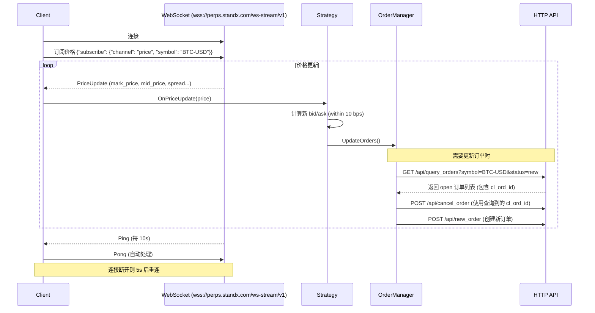

# StandX 做市机器人架构设计

## 项目概述

自动挂单机器人，用于参与 StandX Market Maker Uptime Program，通过持续提供流动性获取积分奖励。

### 目标

- 自动维持双边挂单（bid + ask）
- 订单价格保持在中间价 10 bps 以内
- 每小时保持 70%+ 在线时间
- 订单规模接近 2 BTC 上限
- **风险控制**: 吃单后立即平仓，不累积仓位

## 技术选型

| 技术栈 | 选择 | 理由 |
|--------|------|------|
| 语言 | Go 1.21+ | 高并发、高性能、部署简单 |
| 加密 | crypto/ed25519 | 标准库，无需外部依赖 |
| Base58 | github.com/mr-tron/base58 | requestId 编码 |
| 以太坊 | github.com/ethereum/go-ethereum | 钱包签名 |
| HTTP | net/http | 标准库 |
| WebSocket | gorilla/websocket | 成熟的 WebSocket 库 |
| 配置 | github.com/spf13/viper | 灵活配置管理 |
| 日志 | slog (Go 1.21+) | 结构化日志 |

## 模块设计

### 1. 认证模块 (pkg/auth)

**职责**: 处理 StandX API 认证

**核心流程**:
```
1. 生成 ed25519 密钥对
2. requestId = base58(publicKey)
3. prepare-signin 获取 signedData
4. 钱包签名 message
5. login 获取 access token
```

**接口定义**:
```go
type Auth struct {
    ed25519PrivateKey ed25519.PrivateKey
    ed25519PublicKey  ed25519.PublicKey
    requestId         string
    baseURL           string
}

func (a *Auth) Authenticate(chain, address string, signFn SignFunc) (*LoginResponse, error)
func (a *Auth) SignRequest(payload []byte, reqID string, timestamp int64) (*RequestSignature, error)
```

**关键类型**:
```go
type Chain string // "bsc" | "solana"

type SignedData struct {
    Domain    string
    URI       string
    Statement string
    Version   string
    ChainID   int
    Nonce     string
    Address   string
    RequestID string
    Message   string
    Exp       int
    Iat       int
}

type LoginResponse struct {
    Token      string
    Address    string
    Alias      string
    Chain      string
    PerpsAlpha bool
}
```

### 2. API 客户端 (pkg/client)

**职责**: 封装 StandX API 调用，自动处理请求签名

**核心功能**:
- 自动添加认证头
- 请求签名 (Body Signature Flow)
- 错误处理和重试
- Token 刷新

### 2.5 WebSocket 客户端 (pkg/ws)

**职责**: 实时接收市场价格数据和订单状态更新

**核心功能**:
- 订阅价格推送
- Ping/Pong 心跳维持（服务器每 10s Ping，5 分钟无响应断开）
- 自动重连

> **注意**: 订单 channel 订阅已移除，现在通过 HTTP API 查询订单获取 `cl_ord_id`

**接口定义**:
```go
type WSClient struct {
    conn        *websocket.Conn
    url         string
    priceHandler PriceHandler
    orderHandler OrderHandler
    reconnectCh chan struct{}
    done        chan struct{}
}

type PriceHandler interface {
    OnPriceUpdate(PriceData)
}

func (ws *WSClient) Connect() error
func (ws *WSClient) SubscribePrice(symbol string) error
func (ws *WSClient) Close() error
```

> **注意**: `OrderHandler` 和 `SubscribeOrder()` 已移除，订单信息通过 HTTP API 查询

**价格数据结构**:
```go
type PriceData struct {
    Seq        int64     `json:"seq"`
    Channel    string    `json:"channel"`
    Symbol     string    `json:"symbol"`
    Data       PriceDetail `json:"data"`
}

type PriceDetail struct {
    Base       string  `json:"base"`
    IndexPrice string  `json:"index_price"`
    LastPrice  string  `json:"last_price"`
    MarkPrice  string  `json:"mark_price"`
    MidPrice   string  `json:"mid_price"`
    Quote      string  `json:"quote"`
    Spread     []string `json:"spread"`  // [bid, ask]
    Symbol     string  `json:"symbol"`
    Time       string  `json:"time"`
}
```

**订单数据结构**:
```go
type OrderData struct {
    Seq        int64     `json:"seq"`
    Channel    string    `json:"channel"`
    Data       OrderDetail `json:"data"`
}

type OrderDetail struct {
    ID            int       `json:"id"`
    Symbol        string    `json:"symbol"`
    Side          string    `json:"side"`
    OrderType     string    `json:"order_type"`
    Price         string    `json:"price"`
    Qty           string    `json:"qty"`
    FillQty       string    `json:"fill_qty"`
    FillAvgPrice  string    `json:"fill_avg_price"`
    Status        string    `json:"status"`
    TimeInForce   string    `json:"time_in_force"`
    ReduceOnly    bool      `json:"reduce_only"`
    Leverage      string    `json:"leverage"`
    Margin        string    `json:"margin"`
    CreatedAt     string    `json:"created_at"`
    UpdatedAt     string    `json:"updated_at"`
    ClOrdID       string    `json:"cl_ord_id"`       // 平台生成的 client order ID
    PositionID    int       `json:"position_id"`
    AvailLocked   string    `json:"avail_locked"`
}
```

**订阅请求格式**:
```json
// 订阅价格（无需认证）
{
  "subscribe": {
    "channel": "price",
    "symbol": "BTC-USD"
  }
}

// 订阅订单（需要先认证）
// Step 1: 使用 JWT token 认证
{
  "auth": {
    "token": "<your_jwt_token>",
    "streams": [{ "channel": "order" }]
  }
}

// Step 2: 认证成功后订阅订单
{
  "subscribe": {
    "channel": "order"
  }
}
```

**认证响应**:
```json
{
  "seq": 1,
  "channel": "auth",
  "data": { "code": 200, "msg": "success" }
}
```

**订单推送响应示例**:
```json
{
  "seq": 35,
  "channel": "order",
  "data": {
    "id": 2547027,
    "symbol": "BTC-USD",
    "side": "buy",
    "order_type": "market",
    "price": "121245.20",
    "qty": "1.000",
    "fill_qty": "1.000",
    "fill_avg_price": "121245.21",
    "status": "filled",
    "time_in_force": "ioc",
    "reduce_only": false,
    "leverage": "15",
    "margin": "8083.013333334",
    "cl_ord_id": "01K2C9H93Y42RW8KD6RSVWVDVV",
    "position_id": 15,
    "avail_locked": "0",
    "created_at": "2025-08-11T10:06:37.182464902Z",
    "updated_at": "2025-08-11T10:06:37.182465022Z",
    "user": "bsc_0x..."
  }
}
```

**WebSocket 端点**:
```
wss://perps.standx.com/ws-stream/v1
```

**Client Order ID 管理策略**:
1. 创建订单时不传入 `cl_ord_id`，由平台自动生成
2. 取消订单时，通过 HTTP API 查询当前 open 订单获取 `cl_ord_id`
3. 使用查询到的 `cl_ord_id` 调用取消订单接口

> **优点**: 消除了 WebSocket 异步接收 `cl_ord_id` 导致的竞态条件问题

### 3. 订单管理器 (pkg/order)

**职责**: 管理订单生命周期

**核心功能**:
- 创建双边挂单（限价单 + 止损/止盈）
- 自动刷新订单
- 取消订单（通过 HTTP API 查询获取 cl_ord_id）

**接口定义**:
```go
type Manager struct {
    client    *client.Client
    bidOrder  *TrackedOrder
    askOrder  *TrackedOrder
    mutex     sync.RWMutex
}

type TrackedOrder struct {
    Order      *client.Order
    State      OrderState
    UpdateTime time.Time
}

func (m *Manager) PlaceBidAsk(bidPrice, askPrice, size float64) error
func (m *Manager) UpdateOrders(newBidPrice, newAskPrice float64) error
func (m *Manager) CancelAll() error
func (m *Manager) GetActiveOrders() (*OrderPair, error)
```

**Client Order ID 管理流程**:
```go
// 1. 创建订单时不传入 cl_ord_id，由平台自动生成
req := &client.NewOrderRequest{
    Symbol:      symbol,
    Side:        client.OrderBid,
    OrderType:   client.OrderTypeLimit,
    Qty:         client.FormatQty(qty),
    Price:       client.FormatPrice(price),
    SlPrice:     client.FormatPrice(slPrice),
    TpPrice:     client.FormatPrice(tpPrice),
    TimeInForce: client.TimeInForceGTC,
    ReduceOnly:  false,
    // ClOrdID 不传，由平台自动生成
}

// 2. 订单创建成功，无需保存 cl_ord_id（取消时通过查询获取）

// 3. 取消订单时，先查询当前 open 订单
func (m *Manager) cancelBidOrder() error {
    // 查询当前 open 订单
    orders, err := m.client.GetOpenOrdersByStatus(m.symbol, "new")
    if err != nil {
        return err
    }

    // 找到 buy side 的订单
    var clOrdID string
    for _, ord := range orders {
        if ord.Side == "buy" {
            clOrdID = ord.ClOrdID
            break
        }
    }

    // 使用查询到的 cl_ord_id 取消订单
    return m.client.CancelOrder(clOrdID)
}
```

**订单创建参数**:
```go
type CreateOrderRequest struct {
    Symbol     string  `json:"symbol"`     // "BTC-USD"
    Side       string  `json:"side"`       // "bid" | "ask"
    OrderType  string  `json:"order_type"` // "limit"
    Qty        string  `json:"qty"`        // 订单数量 (BTC)
    Price      string  `json:"price"`      // 限价
    SlPrice    string  `json:"sl_price"`   // 止损价格 (开单价 ±2bp)
    TpPrice    string  `json:"tp_price"`   // 止盈价格 (开单价 ±2bp)
    ClOrdID    string  `json:"cl_ord_id,omitempty"` // 不传，由平台生成
}
```

**止损/止盈价格计算**:
```
N bp = 配置中的 sl_tp_bps (默认 2bp = 0.02%)

Bid 单（买入）:
- 开仓价格 = bidPrice
- 止损价格 = bidPrice × (1 - N/10000)  // 低于开仓 N bp
- 止盈价格 = bidPrice × (1 + N/10000)  // 高于开仓 N bp

Ask 单（卖出）:
- 开仓价格 = askPrice
- 止损价格 = askPrice × (1 + N/10000)  // 高于开仓 N bp
- 止盈价格 = askPrice × (1 - N/10000)  // 低于开仓 N bp

无论价格涨跌，都在 N bp 范围内自动平仓
```

### 4. 做市策略 (pkg/strategy)

**职责**: 实现做市逻辑，决定挂单价格和规模

**核心算法**:
```
1. WebSocket 接收价格更新
2. 计算挂单价格:
   - bid = markPrice × (1 - spread/2)
   - ask = markPrice × (1 + spread/2)
3. 确保在 10 bps 以内
4. 订单规模 = 2 BTC (可配置)
```

**接口定义**:
```go
type MarketMaker struct {
    orderMgr  *order.Manager
    pricer    *Pricer
    config    *Config
}

func (mm *MarketMaker) Run(ctx context.Context) error
func (mm *MarketMaker) calculatePrices() (bid, ask float64, err error)
```

### 5. 风险管理 (pkg/risk)

**职责**: 资金检查，确保有足够余额开单

**风险场景分析**:
```
价格快速上涨: ask 单被成交 → 卖出 BTC → 空头仓位
价格快速下跌: bid 单被成交 → 买入 BTC → 多头仓位
```

**采用策略: SL/TP 自动平仓**

核心原则：
- 开单时同时设置止损（SL）和止盈（TP）
- SL/TP 价格在开单价 ±N bp 范围内（可配置，默认 1-2bp）
- 吃单后通过 SL/TP 自动平仓，无需代码主动处理
- 仅在资金不足时暂停开单，等待 SL/TP 触发后恢复

**优势**:
- ✅ 代码逻辑大幅简化
- ✅ 无需监听订单成交事件
- ✅ 无需手动平仓操作
- ✅ 风险可控（最多损失 N bp）

**接口定义**:
```go
type RiskManager struct {
    client           *client.Client
    minBalanceRatio  float64  // 最低余额比例 (0.2 = 保留20%)
}

// 检查是否有足够余额开单
func (rm *RiskManager) HasSufficientBalance(orderSize float64) (bool, error)

// 获取当前账户余额
func (rm *RiskManager) GetBalance() (*Balance, error)
```

**SL/TP 价格自动平仓机制**:
```
Bid 单（买入）成交后 → 持有多头 BTC
  → TP 触发: 价格达到 bidPrice × (1 + N bp) → 自动卖出平仓
  → SL 触发: 价格达到 bidPrice × (1 - N bp) → 自动卖出平仓

Ask 单（卖出）成交后 → 持有空头
  → TP 触发: 价格达到 askPrice × (1 - N bp) → 自动买入平仓
  → SL 触发: 价格达到 askPrice × (1 + N bp) → 自动买入平仓

无论价格涨跌，都在 N bp 范围内自动平仓
```

**资金检查流程**:
```go
func (rm *RiskManager) HasSufficientBalance(orderSize float64) (bool, error) {
    balance, err := rm.GetBalance()
    if err != nil {
        return false, err
    }

    // 计算所需保证金（简化计算）
    required := orderSize * balance.MarkPrice * rm.minBalanceRatio

    available, _ := strconv.ParseFloat(balance.Available, 64)
    return available >= required, nil
}
```

### 6. 在线监控 (pkg/monitor)

**职责**: 追踪在线时间和积分指标

**接口定义**:
```go
type UptimeMonitor struct {
    hourStart    time.Time
    activeMinutes int
    lastUpdate   time.Time
}

func (m *UptimeMonitor) RecordActive() error
func (m *UptimeMonitor) GetUptimePercentage() float64
func (m *UptimeMonitor) ShouldBeInBoostedTier() bool
```

## 配置设计

### config.yaml

```yaml
# 链配置
chain: bsc  # bsc | solana

# 钱包配置 (通过环境变量)
# WALLET_PRIVATE_KEY

# StandX API
api:
  base_url: https://api.standx.com
  perps_url: https://perps.standx.com
  timeout: 30s

# 做市策略配置
strategy:
  symbol: BTC-USD
  order_qty: 2.0         # BTC
  spread_bps: 8          # 挂单价差 (10 bps 以内)

# 风险管理配置（SL/TP 自动平仓）
risk:
  enabled: true               # 是否启用风险管理
  sl_tp_bps: 2                # SL/TP 价格浮动范围 (1-2bp)
  min_balance_ratio: 0.2      # 最低余额比例 (保留20%用于保证金)
  check_interval: 1s          # 余额检查间隔

# WebSocket 配置
websocket:
  url: wss://perps.standx.com/ws-stream/v1
  ping_interval: 10s     # 服务器 Ping 间隔
  pong_timeout: 5m       # Pong 超时断开时间
  reconnect_delay: 5s    # 重连延迟

# 监控配置
monitor:
  uptime_threshold: 0.70  # 70% 在线时间目标
  log_interval: 5m        # 状态日志间隔

# 日志配置
log:
  level: info  # debug | info | warn | error
  format: json # json | text
```

## 环境变量

### 必需环境变量

| 变量名 | 说明 | 示例 |
|--------|------|------|
| `WALLET_PRIVATE_KEY` | 钱包私钥（64位十六进制） | `0x1234...abcd` |

> ⚠️ **安全提示**: 私钥不应直接写入配置文件或代码中，请使用环境变量或密钥管理工具。

### 可选环境变量

目前所有可选配置都通过 `configs/config.yaml` 文件管理。如需覆盖配置，可以在运行时设置：

```bash
# 示例：通过环境变量覆盖配置（需要修改代码支持）
CHAIN=solana ./bin/market-maker
```

### 配置文件与代码对应关系

| 配置项 | 配置路径 | 代码中使用 | 说明 |
|--------|----------|-----------|------|
| 链配置 | `chain` | `cfg.Chain` | bsc 或 solana |
| API 基础 URL | `api.base_url` | `cfg.API.BaseURL` | 认证服务地址 |
| API Perps URL | `api.perps_url` | `cfg.API.PerpsURL` | Perps API 地址 |
| 交易对 | `strategy.symbol` | `cfg.Strategy.Symbol` | 如 BTC-USD |
| 订单数量 | `strategy.order_qty` | `cfg.Strategy.OrderQty` | 订单数量（BTC） |
| 价差基点 | `strategy.spread_bps` | `cfg.Strategy.SpreadBPS` | 挂单价差 |
| 风险管理开关 | `risk.enabled` | `cfg.Risk.Enabled` | 是否启用余额检查 |
| SL/TP 基点 | `risk.sl_tp_bps` | `cfg.Risk.SlTpBPS` | 止损止盈浮动范围 |
| 最低余额比例 | `risk.min_balance_ratio` | `cfg.Risk.MinBalanceRatio` | 保留保证金比例 |
| WebSocket URL | `websocket.url` | `cfg.WS.URL` | WebSocket 地址 |
| 重连延迟 | `websocket.reconnect_delay` | `cfg.WS.ReconnectDelay` | 断线重连延迟 |
| 日志级别 | `log.level` | `cfg.Log.Level` | 日志详细程度 |
| 日志格式 | `log.format` | `cfg.Log.Format` | json 或 text |

### 启动命令示例

```bash
# 1. 设置私钥环境变量
export WALLET_PRIVATE_KEY=0x...

# 2. 编辑配置文件
vim configs/config.yaml

# 3. 启动做市机器人
./bin/market-maker

# 或使用 Docker
docker run -e WALLET_PRIVATE_KEY=0x... -v $(pwd)/configs:/app/configs standx-mm
```

### 最小配置示例

```yaml
# configs/config.yaml
chain: bsc
strategy:
  symbol: BTC-USD
  order_qty: 0.5       # 小单测试
  spread_bps: 8
risk:
  enabled: true
  sl_tp_bps: 2
  min_balance_ratio: 0.2
websocket:
  url: wss://perps.standx.com/ws-stream/v1
  reconnect_delay: 5s
log:
  level: debug         # 调试模式
  format: text
```

## 配置读取流程


## 配置数据结构

### Config 结构体字段映射

```go
type Config struct {
    Chain    string      // chain: bsc
    API      APIConfig   // api.*
    Strategy Strategy    // strategy.*
    Risk     RiskConfig  // risk.*
    WS       WSConfig    // websocket.*
    Monitor  Monitor     // monitor.*
    Log      LogConfig   // log.*
}
```

### 配置读取优先级

1. **配置文件** (`configs/config.yaml`) - 默认配置
2. **环境变量** - 可覆盖（需要代码支持）
3. **代码默认值** - 兜底逻辑

### 关键配置验证

程序启动时会验证以下关键配置：

| 配置项 | 验证条件 | 错误处理 |
|--------|----------|----------|
| `WALLET_PRIVATE_KEY` | 必须存在且有效 | 程序退出 |
| `chain` | bsc 或 solana | 使用默认值 |
| `strategy.symbol` | 非空 | 程序退出 |
| `strategy.order_qty` | > 0 | 程序退出 |
| `strategy.spread_bps` | 1-10 | 警告日志 |
| `websocket.url` | 有效 URL | 使用默认值 |

## 数据流

```mermaid
flowchart TD
    subgraph WS["WebSocket 连接"]
        WSStream[WebSocket Stream<br/>wss://perps.standx.com/ws-stream/v1]
    end

    subgraph Main["主流程"]
        Start([启动]) --> Auth[认证获取 Token]
        Auth --> WSConn[连接 WebSocket]
        WSConn --> SubPrice[订阅价格: BTC-USD]

        SubPrice --> PriceWS{{接收价格推送}}
        PriceWS -->|价格变动| CalcPrices[计算新价格<br/>within 10 bps]
        CalcPrices --> CheckBalance{检查余额<br/>是否足够?}
        CheckBalance -->|否| WaitBalance[等待 SL/TP<br/>释放保证金]
        CheckBalance -->|是| NeedUpdate{需要更新订单?}
        NeedUpdate -->|是| QueryOrders[查询 open 订单<br/>获取 cl_ord_id]
        QueryOrders --> CancelOrders[取消旧订单]
        CancelOrders --> CreateOrder[创建新订单]
        CreateOrder --> UpdateOrders[更新订单]
        NeedUpdate -->|否| RecordUptime
        UpdateOrders --> RecordUptime[记录在线时间]
        WaitBalance --> RecordUptime

        RecordUptime --> LogStatus[记录状态日志]
        LogStatus --> PriceWS
    end

    subgraph Reconnect["重连机制"]
        WSConn -->|连接断开| Reconnect[等待 5s]
        Reconnect --> WSConn
        WSStream -.->|Ping 每 10s| WSConn
    end

    style WS fill:#e1f5fe
    style Main fill:#f3e5f5
    style Reconnect fill:#fff3e0
    style WaitBalance fill:#fff9c4
    style SaveClOrdID fill:#c8e6c9
    style CancelOrder fill:#ffcc80
```

### SL/TP 自动平仓机制

开单时设置的 SL/TP 由交易所自动处理，代码无需干预：

```
开单: bidPrice=50000, qty=2, sl=49999, tp=50001 (±1bp)

场景1 - 价格上涨:
  → TP 触发 @ 50001 → 自动平多头 → 释放保证金 → 恢复做市

场景2 - 价格下跌:
  → SL 触发 @ 49999 → 自动平多头 → 释放保证金 → 恢复做市

无论涨跌，都在 ±1bp 范围内自动平仓，无需代码处理
```

### WebSocket 消息处理流程



**关键变化**:
- ❌ 移除了订单 channel 订阅
- ✅ 使用 HTTP API 查询订单获取 `cl_ord_id`
- ✅ 消除了 WebSocket 异步接收 `cl_ord_id` 的竞态条件

## 错误处理策略

| 错误类型 | 处理方式 |
|----------|----------|
| WebSocket 断开 | 5秒后自动重连 |
| Ping/Pong 超时 | 重连连接 |
| API 超时 | 重试 3 次，指数退避 |
| 认证失败 | 重新认证，记录日志 |
| 订单拒绝 | 检查价格/余额，调整参数 |
| 余额不足 | 暂停开单，等待 SL/TP 触发释放保证金 |
| SL/TP 失败 | 由交易所自动处理，代码无需干预 |

## 风险控制总结

| 控制项 | 限制值 | 说明 |
|--------|--------|------|
| 风险策略 | SL/TP 自动平仓 | 最简单方案 |
| 单笔最大亏损 | N bp | 可配置 (1-2bp) |
| 最大仓位 | N bp | 不累积仓位 |
| 资金检查 | min_balance_ratio | 保留 20% 余额 |

## 安全考虑

1. **私钥管理**
   - 私钥通过环境变量传入
   - 不写入日志
   - 不写入配置文件

2. **API 密钥**
   - Access Token 内存存储
   - 定期刷新机制

3. **请求签名**
   - 每次请求独立签名
   - 时间戳防重放

## 部署建议

### 本地运行
```bash
export WALLET_PRIVATE_KEY=0x...
go run cmd/main.go
```

### Docker 部署
```dockerfile
FROM golang:1.21-alpine AS builder
WORKDIR /app
COPY . .
RUN go build -o mm cmd/main.go

FROM alpine:latest
COPY --from=builder /app/mm /usr/local/bin/
CMD ["mm"]
```

### Systemd 服务
```ini
[Unit]
Description=StandX Market Maker
After=network.target

[Service]
Type=simple
User=standx
Environment="WALLET_PRIVATE_KEY=0x..."
ExecStart=/usr/local/bin/mm
Restart=always

[Install]
WantedBy=multi-user.target
```

## 开发计划

| 阶段 | 任务 | 状态 |
|------|------|------|
| Phase 1 | 认证模块 (pkg/auth) | 待开始 |
| Phase 2 | WebSocket 客户端 (pkg/ws) | 待开始 |
| Phase 3 | API 客户端 (pkg/client) | 待开始 |
| Phase 4 | 订单管理 (pkg/order) | 待开始 |
| Phase 5 | 风险管理 (pkg/risk) - 立即平仓策略 | 待开始 |
| Phase 6 | 做市策略 (pkg/strategy) | 待开始 |
| Phase 7 | 在线监控 (pkg/monitor) | 待开始 |
| Phase 8 | 主程序集成 (cmd/main.go) | 待开始 |
| Phase 9 | 测试与优化 | 待开始 |

## TODO 优化项

### 1. 时间窗口控制

**目标**: 避开高波动时间段（如中国时间晚上 10 点到凌晨 1 点）

**实现方案**:
```go
type TimeWindowFilter struct {
    TimeZone string  // 时区，如 "Asia/Shanghai"
    Windows  []TimeWindow  // 禁止运行的时间窗口
}

type TimeWindow struct {
    Start string  // "22:00"
    End   string  // "01:00"  // 支持跨天
}

func (f *TimeWindowFilter) ShouldRun(now time.Time) bool {
    // 检查当前时间是否在禁止窗口内
    // 如果在窗口内，暂停下单但保持价格更新
}
```

**集成位置**:
- `pkg/strategy/marketmaker.go` - 在 `OnPriceUpdate` 中检查
- 配置文件添加 `time_windows` 配置

---

### 2. 波动保护机制

**目标**: 短时间内价格波动超过 50 bps 时暂停做市

**实现方案**:
```go
type VolatilityGuard struct {
    thresholdBPS  int     // 50 bps
    windowSec     int     // 检测窗口（秒）
    priceHistory  []PriceSnapshot
}

type PriceSnapshot struct {
    timestamp time.Time
    price     float64
}

func (g *VolatilityGuard) ShouldPause(currentPrice float64) bool {
    // 计算窗口内的价格变化
    // 如果超过阈值，暂停下单
    // 返回 true 表示应该暂停
}
```

**集成位置**:
- `pkg/strategy/marketmaker.go` - 在下单前检查波动率
- 配置文件添加 `volatility_protection` 配置

---

### 3. API 调用优化

**问题**: 每次 `UpdateOrders` 需要调用 2 次 `GetOpenOrdersByStatus`（bid + ask 各一次）

**优化方案**:
```go
// 当前实现: 每次更新调用 2 次 API
func (m *Manager) UpdateOrders(newBid, newAsk float64) error {
    m.cancelBidOrder()   // 调用 GetOpenOrdersByStatus
    m.cancelAskOrder()   // 再次调用 GetOpenOrdersByStatus
    // ...
}

// 优化后: 只调用 1 次 API
func (m *Manager) UpdateOrders(newBid, newAsk float64) error {
    // 一次性查询所有 open 订单
    orders, _ := m.client.GetOpenOrdersByStatus(m.symbol, "open")

    // 从缓存中找到 bid 和 ask 订单
    bidClOrdID := findOrderBySide(orders, "buy")
    askClOrdID := findOrderBySide(orders, "sell")

    // 批量取消
    if bidClOrdID != "" { m.client.CancelOrder(bidClOrdID) }
    if askClOrdID != "" { m.client.CancelOrder(askClOrdID) }
    // ...
}
```

**收益**: API 调用减少 50%

**实现位置**:
- `pkg/order/manager.go` - `UpdateOrders` 方法

---

### 4. 智能撤单策略

**问题**: 当挂单价差较大（10-30 bps）时，频繁撤单重挂增加成本

**优化策略**:
```go
type SmartCancelStrategy struct {
    maxSpreadBPS int  // 最大允许价差（10 bps）
    minPriceChangeBPS int  // 最小价格变化阈值（1 bps）
}

func (s *SmartCancelStrategy) ShouldUpdateOrder(
    currentOrderPrice float64,
    marketPrice float64,
) bool {
    // 计算挂单价与市价的价差
    spreadBPS := calculateSpreadBPS(currentOrderPrice, marketPrice)

    // 如果价差 < 10 bps，不需要更新（已经在范围内）
    if spreadBPS < s.maxSpreadBPS {
        return false
    }

    // 如果价差 >= 10 bps，需要更新
    return true
}
```

**逻辑**:
```
当前挂单价: 50000, 市价: 50010, 价差: 10 bps
→ 不撤单，等待市价接近

当前挂单价: 50000, 市价: 50050, 价差: 50 bps
→ 撤单重挂，保持价差在 10 bps 内
```

**集成位置**:
- `pkg/strategy/marketmaker.go` - `shouldUpdateOrders` 方法
- 配置文件添加 `smart_cancel` 配置

---

### 5. JWT Token 过期处理

**问题**: 当前使用 JWT 认证，但代码没有处理 token 过期场景

**现状**:
```go
// 当前实现: token 永久使用，不检查过期
apiClient.SetToken(loginResp.Token)  // 假设 token 永不过期

// 如果 token 过期，API 调用会返回 401 错误
resp, err := c.doRequest("POST", "/api/new_order", payload, signatures)
if resp.StatusCode == 401 {
    // 当前没有处理逻辑
}
```

**实现方案**:
```go
type TokenManager struct {
    token         string
    expiresAt     time.Time
    refreshBefore time.Duration  // 提前 5 分钟刷新
    authMgr       *auth.Auth
    chain         auth.Chain
    address       string
    signFn        auth.SignFunc
    mu            sync.RWMutex
}

func (tm *TokenManager) GetToken() (string, error) {
    tm.mu.RLock()
    if time.Until(tm.expiresAt) > tm.refreshBefore {
        token := tm.token
        tm.mu.RUnlock()
        return token, nil
    }
    tm.mu.RUnlock()

    // Token 即将过期或已过期，刷新
    return tm.refreshToken()
}

func (tm *TokenManager) refreshToken() (string, error) {
    tm.mu.Lock()
    defer tm.mu.Unlock()

    loginResp, err := tm.authMgr.Authenticate(tm.chain, tm.address, tm.signFn)
    if err != nil {
        return "", err
    }

    tm.token = loginResp.Token
    // 根据 JWT claims 解析过期时间
    tm.expiresAt = parseTokenExpiry(loginResp.Token)

    return tm.token, nil
}
```

**API 调用拦截**:
```go
func (c *Client) doRequest(method, path string, body []byte, signatures map[string]string) (*http.Response, error) {
    resp, err := c.httpClient.Do(req)

    // 检查 401 错误
    if resp.StatusCode == 401 {
        // Token 过期，刷新后重试
        if c.tokenMgr != nil {
            newToken, _ := c.tokenMgr.GetToken()
            c.SetToken(newToken)
            signatures = c.auth.SignRequest(body, reqID, timestamp)
            req.Header.Set("Authorization", "Bearer "+newToken)
            // 重试请求
            return c.httpClient.Do(req)
        }
    }

    return resp, err
}
```

**集成位置**:
- `pkg/client/client.go` - 添加 `TokenManager` 依赖
- `pkg/auth/` - 添加 `parseTokenExpiry()` 函数
- `cmd/main.go` - 使用 `TokenManager` 替代直接 `SetToken`

**优先级**: **高** - 生产环境必需

---

### 优先级建议

| TODO | 优先级 | 预计工作量 | 收益 |
|------|--------|-----------|------|
| 1. 时间窗口控制 | 中 | 2-3 小时 | 避开高风险时段 |
| 2. 波动保护机制 | 高 | 2-3 小时 | 防止异常波动损失 |
| 3. API 调用优化 | 高 | 1 小时 | 减少 API 调用 50% |
| 4. 智能撤单策略 | 中 | 3-4 小时 | 降低交易成本 |
| 5. JWT Token 过期处理 | 高 | 2-3 小时 | 生产环境必需 |

## 参考文档

- [StandX Perps Auth](https://docs.standx.com/standx-api/perps-auth)
- [StandX Perps WebSocket API](https://docs.standx.com/standx-api/perps-ws)
- [Market Maker Rules](https://docs.standx.com/docs/stand-x-campaigns/market-maker-uptime-program)
- [StandX Perps HTTP API](https://docs.standx.com/standx-api/perps-http-api)
